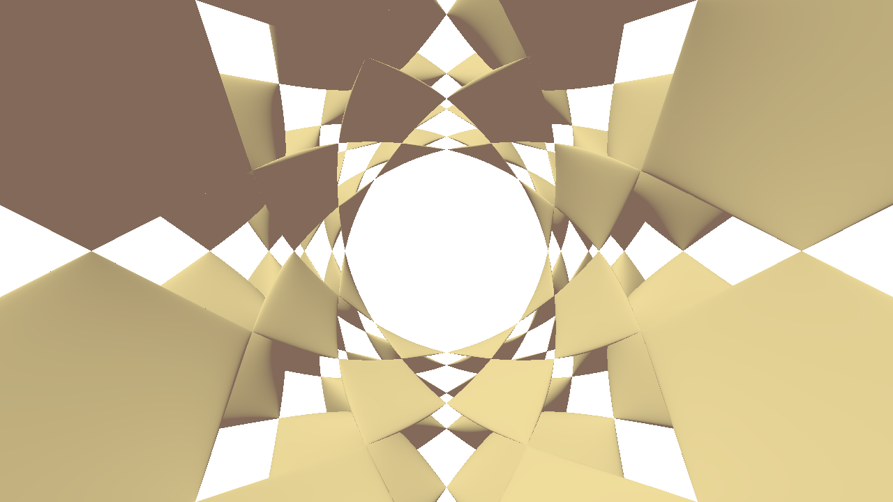

# Robust Ray–Surface Intersections for Algebraic Surfaces

This project contains the implementation for the Eurographics 2026 Short Paper: *Robust Ray–Surface Intersections for Algebraic Surfaces*.

## Building and running the project

- Clone [Falcor 8.0](https://github.com/NVIDIAGameWorks/Falcor/tree/8.0)
- Clone this repository into `Falcor\Source\Samples\Tracers\`
- Add `Tracers` to the cmake file `Falcor\Source\Samples\CMakeLists.txt`
  - Add the line `add_subdirectory(Tracers)`
- Run `setup` in `Falcor`'s root
- On Windows and Visual Studio 2022
  - Run `Falcor\setup_vs2022.bat`
  - Run `Falcor\build\windows-vs2022\Falcor.sln`
  - Set `Tracers` as the Startup Project
  - Build & run (some dependencies are not set right in Falcor, Build Solution might be necessary)
